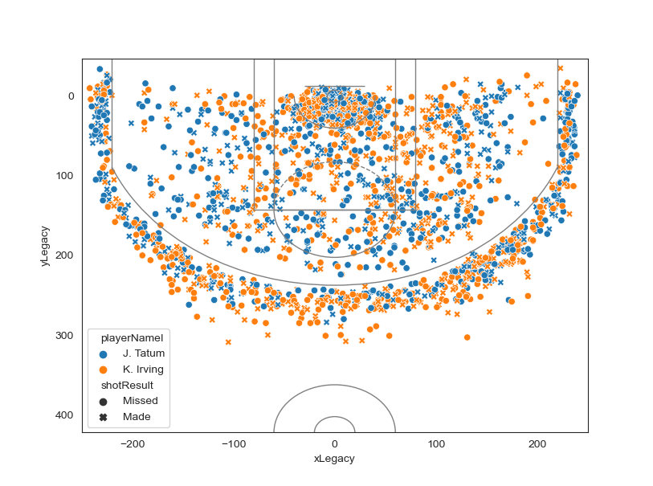

# nba-scraper
Gets play-by-play data from the NBA website

1. Use link_scraper.py to specify the date range of the games, then run it. This will output a date and link for each game in that date range.

2. Use get_plays.py to generate a .csv file that will use the links generated from link_scraper.py to get summary statistics about each player in each game within the date range.

3. Perform analysis on the .csv file generated by get_plays.py.

Note: get_plays.py uses multithreading to speed up the scraping. This will cause the games to be in an unpredictable order.

Copy [this game's JSON data](output/game12018shots.json) into [this](http://jsonviewer.stack.hu/) JSON viewer to get an idea of the data contained in the NBA's website.

